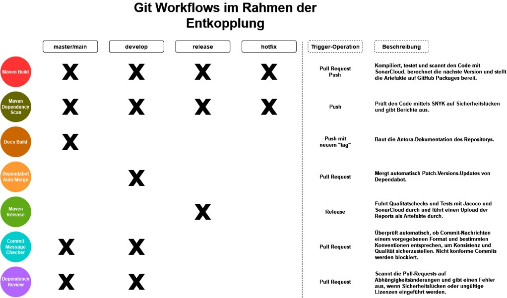

= isy-github-actions-templates
:toc:

Dieses Repository beinhaltet GitHub Action Templates (https://docs.github.com/en/actions/using-workflows/reusing-workflows[Reusable Workflows]). Diese Templates können in bereits vorhandene https://docs.github.com/en/actions/using-workflows/about-workflows[Workflows] eingebunden werden, um ihre Funktionalität mit sehr geringem Aufwand an anderer Stelle nutzen zu können.

Ein Beispiel-Szenario dazu wäre: Der https://github.com/GsActions/commit-message-checker[Commit Message Checker] ist eine fertige GitHub Action, welche es ermöglicht, Commit Messages nach einem RegEx-Muster zu prüfen. Diese Funktionalität ist nun in einigen meiner Repositories mit gewünscht, wobei der Commit Message Checker überall gleich konfiguriert sein soll. Statt die Action nun also in jedem Repository einzeln einzubinden und zu konfigurieren, erstellt man ein Template in einem Repository mit der gewünschten Konfiguration und ruft dieses in allen anderen auf.

== Entkopplungs-Workflows

== Templates

=== Next Version Template

Das Template next_version.yml stellt einen Job zur Berechnung der Versionsnummer eines Builds bereit.
Dazu nutzt es die Action Semantic Version (https://github.com/PaulHatch/semantic-Dversion),
welche die Version auf Basis von Conventional Commits bestimmt.
Die berechnete Version ist als Ausgabe `next-version` für andere Jobs in einem Workflow verfügbar.

[width="100%",cols="20%,^15%,^20%,45%",options="header",]
|===
^|Eingabe ^|Erforderlich ^|Standardwert ^|Beschreibung
|`next-version` |Nein |  |Überspringt die Berechnung der Version und gibt stattdessen die angegebene Version mit `SNAPSHOT` Suffix aus
|===

==== Verwenden der berechneten Version in anderen Jobs

[source,yaml]
[source]
----
jobs:
  Version:
    uses: IsyFact/isyfact-standards/.github/workflows/next_version.yml@master

  OtherJob:
    needs: [Version]
    # ...
    run: echo "${{ needs.Version.outputs.next-version }}"
----

NOTE: Da hier eine Action aus dem GitHub Market von einem Dritten verwendet wird,
wird in dem Template sichergestellt, dass das GitHub Token nur die Rechte contents:read bereitstellt.
Zudem wird die berechnete Version mit dem regulären Ausdruck `^(0|[1-9][0-9]*)\.(0|[1-9][0-9]*)\.(0|[1-9][0-9]*)$` auf Korrektheit geprüft.

=== Build Template

Das Template maven_build_template.yml bietet einen Workflow zum Bauen und Testen von Java/Maven Projekten. Es enthält folgende Jobs:

- *Compile*: +
Führt das Maven Goal `compile` aus.

- *Test*: +
Führt das Maven Goal `test` aus

- *CodeQuality*: +
Führt die beiden Maven Plugins `checkstyle` und ‚spotbugs‘ aus. Der Job wird nur ausgeführt, wenn für ein Projekt Sonar (`SONAR_PROJECT_KEY`) nicht konfiguriert wurde.

- *SonarScan*: +
Führt das Maven Plugin `SonarScan` aus. Der Scan wird nach dem Job `Test` ausgeführt, damit dessen Ergebnisse (insb. die Test Coverage) auch auf Sonar Cloud verfügbar sind. Dieser Job ist optional und wird nur ausgeführt, wenn ein Sonar Projekt Key konfiguriert wurde. Dieser Job schlägt nur fehl, wenn es nicht möglich war eine Analyse durchzuführen. Die Prüfung, ob das zugehörige Quality Gate erfüllt wurde, erfolgt in SonarCloud und wird über einen zusätzlichen Status Check angezeigt. Zudem wird dieser Job nicht bei Pull Requests, die durch den Dependabot erstellt wurden, gestartet, da der Dependabot keinen Zugriff auf das `SONAR_TOKEN` hat.

- *Commit Message Checker*: +
Gleicht die Commit Messages mit einem RegEx-Pattern ab und gibt eine Success bzw. Error Message aus, je nachdem, ob sie der Konvention entsprechen. Ein GitHub-Token (`secrets.GITHUB_TOKEN`), welches ausschließlich ein Lese-Recht auf Inhalte besitzt, wird zur Authentifizierung verwendet.

Beim Aufruf des Templates können folgende Parameter übergeben werden:

[width="100%",cols="20%,^15%,^20%,45%",options="header",]
|===
^|Eingabe ^|Erforderlich ^|Standardwert ^|Beschreibung
|`jdk-version` |Nein |`17` |Version des zu verwendenden JDKs
|`maven-opts` |Nein |`""` |Zusätzliche Argumente, die an Maven weitergegeben werden
|`checkout-lfs` |Nein |`false` |Gibt an, ob LFS-Dateien mit auf den Runner geklont werden
|`version` |Nein |`0.0.0-SNAPSHOT` |Version für Maven CI Friendly Versions
|`sonar-skip` |Nein |`false` |Erlaubt das Überspringen des Jobs SonarScan
4+^|*Secrets*
|`SONAR_TOKEN` |Nein | |Token zu Sonar Cloud um das Ergebnis des Scans zu veröffentlichen
|`GH_PACKAGES_TOKEN` |Nein | |Token für Zugriff auf GitHub Packages
|===

=== Dependency Review Template
Das Template `dependency_review_template.yml` stellt einen Job `DependencyReview` bereit, der verwendet wird, um die Dependencies eines Projekts zu überprüfen und sicherzustellen, dass sie mit den definierten Lizenzanforderungen übereinstimmen.

Die Datei `dependency_review_config.yml` definiert die Lizenztypen, die in den Projekten erlaubt sind. Diese Konfiguration basiert auf bekannten und anerkannten Lizenzreferenzen von https://opensource.google/documentation/reference/thirdparty/licenses[Google Open Source].

=== Dependency Scan Template

Das Template `maven_depenency_scan_template.yml` wurde entwickelt, um Snyk für die Monitoring und Scanning der Open-Source-Dependencies eines Maven-Projektes zu integrieren. Sie enthält verschiedene konfigurierbare Inputs, um die Einrichtung und Ausführung des Dependency-Scan-Prozesses anzupassen.

Beim Aufruf des Templates können folgende Parameter übergeben werden:

[width="100%",cols="20%,^14%,^18%,48%",options="header",]
|===
^|Eingabe ^|Erforderlich ^|Standardwert ^|Beschreibung
|`jdk-version` |Nein |`17` |Version des zu verwendenden JDKs
|`checkout-lfs` |Nein |`false` |Gibt an, ob LFS-Dateien mit auf den Runner geklont werden
|`snyk-organization` |Nein | |Organisations-ID für die Zuordnung auf Snyk
|`snyk-reference` |Ja | |Referenz für das Ergebnis auf Snyk, z.B. Branchname
|`snyk-arguments` |Nein |`--maven-aggregate-project` | Optionale Befehle für die Snyk CLI
|`perform-scan` |Nein |`false` | Durchführung von Scanning statt Monitoring
|`severity-threshold` |Nein |`critical` | Schweregrad für Snyk-Scan
|`scan-dependency-management` |Nein |`true` | Scannen von Dependencies in Dependency Management
4+^|*Secrets*
|`SNYK_TOKEN` |Ja | |Token zur Authentifizierung bei Snyk
|===

=== Deploy Template

Das Template `maven_deploy_template.yml` stellt Jobs zum Veröffentlichen von Artefakten bereit.
Es kann sowohl für die Veröffentlichung von Snapshots als auch stable Releases genutzt werden.
Das Deployment kann auf verschiedene Repositories, wie z.B. Maven Central oder GitHub Packages erfolgen.
Das Template enthält folgende Jobs:

- *Validate*: +
Prüft die Korrektheit eines Releases und insbesondere die verwendete Version. Der Job stellt sicher, dass die angegebene Version im Build/POM verwendet wird und diese den Vorgaben von Semantic Versioning folgt.
Bei Releases, die über tags ausgelöst wurden, wird geprüft, dass es sich bei der Version um keinen Snapshot handelt und, dass die verwendete Version nicht bereits auf Deployment-Repository vorhanden ist.
Bei Releases, die ohne tag erfolgen, wird geprüft, dass es sich um Snapshots handelt.

- *Deploy*: +
Führt das Deployment aus. Neben den Jars (inklusive Source und Dokumentation) kann der Job auch eine SBOM erstellen und  alle erzeugten Artefakte signieren.

Beim Aufruf des Templates können folgende Parameter übergeben werden:
|===
|Eingabe                    |Erforderlich |Standardwert |Beschreibung

|`jdk-version`              |`false`      |`17`         |JDK Version
|`version`                  |`true`       |             |Version des zu deployenden Artefakts
|`maven-opts`               |`false`      |`""`         |Zusätzliche Argumente, die an Maven weitergegeben werden
|`checkout-lfs`             |`false`      |`false`      |Gibt an, ob LFS-Dateien mit auf den Runner geklont werden
|`deploy-server-id`         |`false`      |             |Referenz auf das Deployment-Repo
|`deploy-server-url`        |`false`      |`'https://oss.sonatype.org/service/
local/repositories/releases/content'`                   |URL des Deployment-Repo
|`deploy-url-release`       |`false`      |             |Deployment-URL für Releases
|`deploy-url-snapshot`      |`false`      |             |Deployment-URL für Snapshots
|`sbom`                     |`false`      |`false`      |Erstellt eine SBOM im CycloneDX Format
|`sign`                     |`false`      |`false`      |Signiert alle Artefakte. Erfordert GPG Private Key und Passphrase.
4+|*Secrets*
|`GPG_PRIVATE_KEY`          |`false`      |             |Privater GPG Key zur Signierung der Artefakte
|`GPG_PASSPHRASE`           |`false`      |             |Passphrase für GPG Key
|`DEPLOY_SERVER_USER_NAME`  |`false`      |             |Benutzer für Repository zum Deployment
|`DEPLOY_SERVER_TOKEN`      |`false`      |             |Token oder Passwort für Repository zum Deployment
|`GH_PACKAGES_TOKEN`        |`false`      |             |Token für Zugriff auf GitHub Packages
|===

TIP: Die Secrets (außer dem Token für GitHub Packages) sowie der Input `deploy-server-id` werden durch die GitHub Action `setup-java` einer generierten `settings.xml` hinzugefügt. (https://github.com/actions/setup-java/blob/v3.11.0/docs/advanced-usage.md#publishing-using-apache-maven)

=== OSS Review Toolkit Template
Das Template `oss_review_toolki_template.yml` stellt einen Job zur Verfügung, welcher das OSS Review Toolkit aufruft. Dieses scannt alle Abhängigkeiten im Projekt und prüft sie auf CVEs. Weiterhin werden alle Lizenzen analysiert und gegebenenfalls auf Regelverstöße überprüft. All dies wird dann in verschiedenen Reports mittels Pipeline-Artefakt ausgegeben.
Das Template hat keinerlei Parameter.

=== PR-Agent Template
Das Template `pr_agent_template.yml` automatisiert PR-Analyse und Feedback unter Verwendung des CodiumAI PR-Agenten und OpenAIs ChatGPT. Ausgelöst durch einen `workflow_call`, wird er nur bei von Menschen initiierten Events ausgeführt. Der Workflow benötigt einen OpenAI-API-Schlüssel `OPENAI_KEY` und ein GitHub-Token `GITHUB_TOKEN` als Secrets, die es ihm ermöglichen, sich zu authentifizieren und mit GitHub- und OpenAI-Diensten zu interagieren. Es verfügt über Schreibrechte für Issues, Pull-Requests und Repository-Inhalte, sodass es Überprüfungen und Aktualisierungen effizient automatisieren kann. Dieser Arbeitsablauf steigert die Produktivität, indem er KI zur Erledigung von Routineaufgaben einsetzt und es den Entwicklern ermöglicht, sich auf komplexere Arbeiten zu konzentrieren.

Standardmäßig werden die Befehle `/describe`, `/review`, `/improve` ausgeführt. Eine vollständige Liste der Befehle und ihrer Beschreibungen können unter https://pr-agent-docs.codium.ai/tools/[PR-Agent Documentation/Tools] gefunden werden oder durch Kommentieren des Befehls `/help` im PR.

=== Docs Build Template
Das Template `docs_build_template.yml` erleichtert die automatische Initiierung von Dokumentations-Builds für Antora-Projekte.

==== Features:

- *Auslösen der Dokumentationserstellung*:
Der Workflow löst den Workflow `antora_build.yml` im Repository `IsyFact/isyfact.github.io` unter Verwendung der GitHub CLI aus.

- *Anpassbare Logging*:
Der Workflow ermöglicht es Users, den Log-Schweregrad (`log_level`) und den Log-Fehlerschweregrad (`failure_level`) für den Antora-Build anzugeben. Diese Eingaben sind optional, wobei die Standardwerte auf `info` bzw. `fatal` gesetzt sind.

- *Verarbeitung der Logs*:
Der Workflow wartet, bis der ausgelöste Dokumentationsaufbau abgeschlossen ist.
Dann holt er die Logs ab und verarbeitet sie, indem er die relevanten Abschnitte extrahiert und bereinigt.
Die bereinigten Logs werden in einer Markdown-Datei formatiert, sodass sie als PR-Kommentar gelesen werden können.

- *Integration von Pull-Requests*:
Wenn der Workflow durch einen PR ausgelöst wird, werden die formatierten Logs als Kommentar zum PR veröffentlicht.

- *Fehlerbehandlung*:
Wenn der Antora-Build fehlschlägt, ist der Workflow so konzipiert, dass er ebenfalls fehlschlägt, um sicherzustellen, dass alle Probleme sofort gekennzeichnet werden.

==== Parameters:
[options="header"]
|===
| Eingabe | Erforderlich | Standardwert | Beschreibung

| `log_level`
| Nein
| `info`
| Log-Schweregrad für den Antora-Build (`debug`, `info`, `warn`, `error`)

| `failure_level`
| Nein
| `fatal`
| Log-Fehlerschweregrad für den Antora-Build (`fatal`, `error`, `warn`, `none`)

|*Secrets* |  |  |

| `ANTORA_TRIGGER_TOKEN`
| Ja
|
| GitHub-Token zum Auslösen des Dokumentations-Builds
|===

=== Update Antora Version Template
Das Template `update_antora_version_template.yml` dient dazu, die Version in der Datei `antora.yml` automatisch zu aktualisieren, wenn ein neuer Release-Branch erstellt wird. Der Workflow nutzt das Event `workflow_call`, um den `antora.yml`-Pfad zu setzen, die Versionsdetails aus dem Branch-Namen zu extrahieren und die Datei zu aktualisieren. Danach werden die Änderungen in den aktuellen Branch gepusht. Dies automatisiert den Prozess der Versionsverwaltung in der Dokumentation und sorgt für Konsistenz und Effizienz.

=== Create Release Template

Mithilfe des Templates `maven_create_release_template.yml` wird automatisch ein Release aus einem Tag heraus erstellt.
Die Datei `CHANGELOG.md` im jeweiligen Repository wird als Release Notes verwendet und dargestellt.

=== Dependabot Auto Changelog Template

Mithilfe des Templates `dependabot_auto_changelog_template.yml` wird automatisch ein Changelog-Eintrag in einem Dependabot Merge-Request erstellt.
Dieser wird unter der Überschrift `Dependency Upgrades` zusammengefasst.
